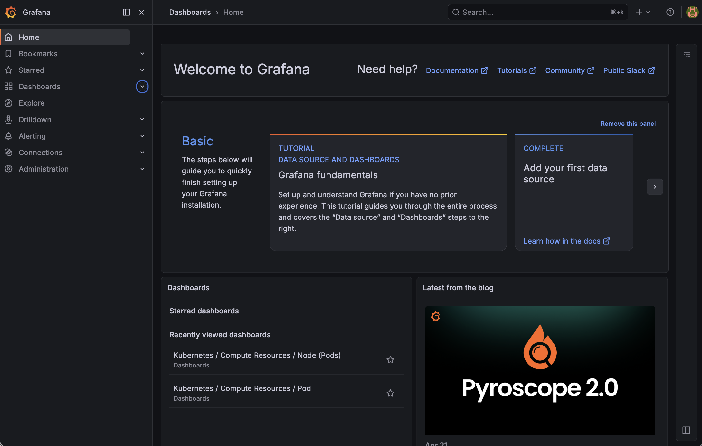
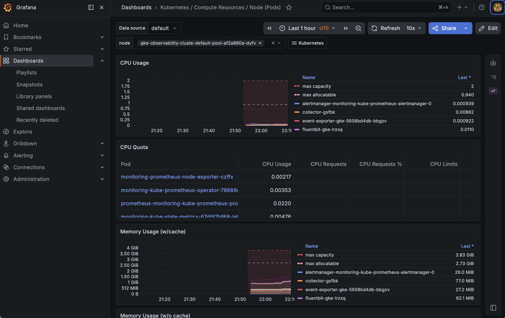
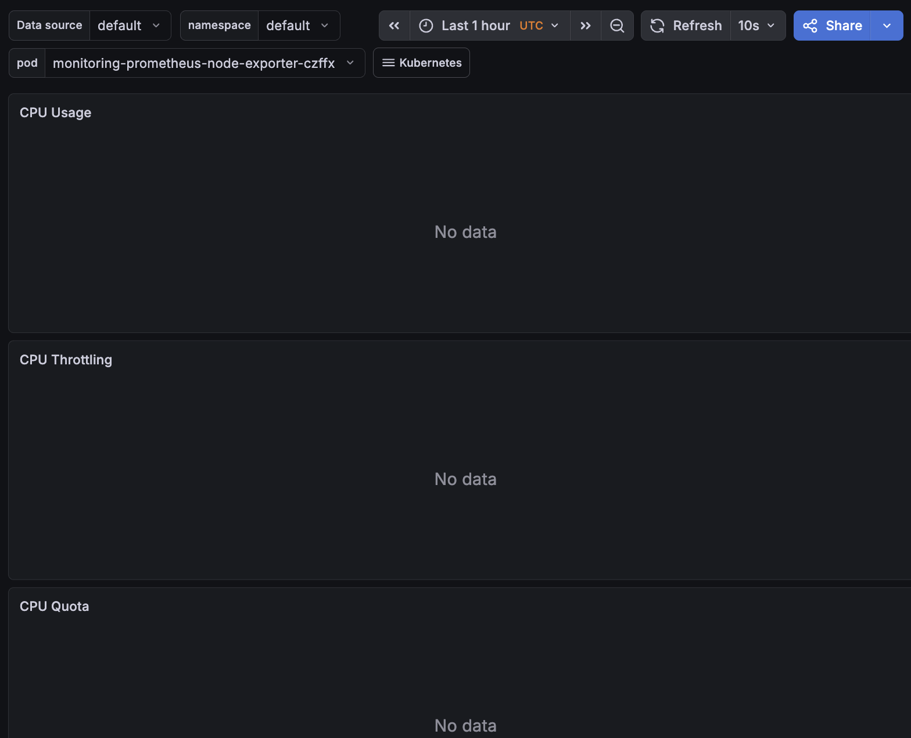

# Cloud Observability Platform (GKE + Prometheus + Grafana)

> Production-ready Kubernetes observability platform deployed on GKE using Terraform, Prometheus, and Grafana — with real-world troubleshooting and cost optimisation.


---

## What this project does

This project provisions a production-style monitoring platform on Google Kubernetes Engine (GKE) using Terraform for infrastructure and Helm for deploying the monitoring stack. Once running, it gives real-time visibility into cluster health, CPU/memory usage, pod-level metrics, and Kubernetes workloads — the same setup used by engineering teams at scale.

---

## Why I built it

Observability is a core skill for any cloud or DevOps engineer. This project shows I can not only provision infrastructure, but instrument it properly so teams can understand what's happening inside their systems in real time.

---

## Tech stack

| Tool | Purpose |
|---|---|
| **Terraform** | Provision GKE cluster as code |
| **GKE (Google Kubernetes Engine)** | Managed Kubernetes cluster |
| **Helm** | Deploy monitoring stack into the cluster |
| **Prometheus** | Scrapes and stores metrics from the cluster |
| **Grafana** | Visualises metrics via dashboards |
| **Alertmanager** | Sends alerts when thresholds are breached |
| **Node Exporter** | Exposes host-level metrics (CPU, RAM, disk) |

---

## Architecture

```
GKE Cluster (Terraform)
└── monitoring namespace (Helm)
    ├── Prometheus        → scrapes all pod/node metrics
    ├── Alertmanager      → routes alerts
    ├── Node Exporter     → host metrics
    └── Grafana           → dashboards & visualisation
```

---

## How to run it

**Prerequisites:** GCP project with billing enabled, `gcloud` CLI, `kubectl`, `helm`, Terraform installed.

### 1. Provision the GKE cluster
```bash
cd terraform
terraform init
terraform apply -var="project_id=YOUR_GCP_PROJECT_ID"
```

### 2. Connect to the cluster
```bash
gcloud container clusters get-credentials observability-cluster \
  --zone europe-west2-a \
  --project YOUR_GCP_PROJECT_ID
```

### 3. Install the monitoring stack
```bash
helm repo add prometheus-community https://prometheus-community.github.io/helm-charts
helm repo update

helm install monitoring prometheus-community/kube-prometheus-stack \
  --namespace monitoring \
  --create-namespace
```

### 4. Access Grafana
```bash
kubectl port-forward svc/monitoring-grafana -n monitoring 3000:80
```
Open `http://localhost:3000` — default login is `admin / prom-operator`.

---

## Project structure

```
.
├── terraform/
│   ├── main.tf           # GKE cluster definition
│   ├── providers.tf      # GCP provider + version constraints
│   └── variables.tf      # Input variables (project_id, region, zone)
└── .github/workflows/
    └── terraform.yml     # CI pipeline (init, fmt, validate, tflint)
```

---

## CI pipeline

Runs automatically on every push to `main`:

| Step | What it does |
|---|---|
| `terraform init` | Downloads providers |
| `terraform fmt --check` | Fails if formatting is off |
| `terraform validate` | Checks for syntax errors |
| `tflint` | Lints for deprecated resources and bad practices |

---

## Evidence

### Grafana Home


### Node Metrics Dashboard


### Pod Metrics Dashboard


---

## What this demonstrates

- **Kubernetes on GCP** — provisioning and managing a GKE cluster with Terraform
- **Helm chart deployment** — installing production monitoring stacks into Kubernetes
- **Observability engineering** — setting up the full metrics pipeline from collection to visualisation
- **Real-world troubleshooting** — handled GCP quota limits, Helm failures, and cluster state conflicts during build
- **Cost-aware infrastructure** — deliberately sized nodes to minimise cost while keeping the stack functional

---

## Future improvements

- Add Terraform remote state (GCS backend)
- Configure Alertmanager to send alerts to Slack or email
- Add custom Grafana dashboards as code (Grafana as code via Terraform)
- Introduce separate node pools for monitoring workloads
